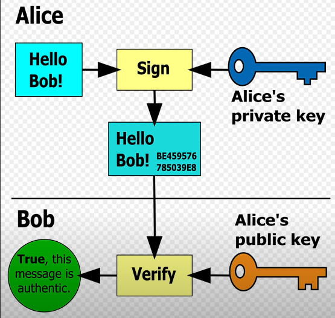

# 📚 Blockchain Learning Journey — Stage 2: Adding Digital Signatures

---

## 📖 What I Learned in This Stage

### 1. Digital Signatures & Cryptography Concepts
In this stage, I deepened my understanding of how blockchain ensures transaction authenticity and security using **digital signatures** and **public-key cryptography**.

- Explored **Elliptic Curve Cryptography (ECC)** and why it’s widely used in blockchain.
- Studied **ECDSA (Elliptic Curve Digital Signature Algorithm)** which Bitcoin and Ethereum use for signing transactions.
- Learned how private keys, public keys, and addresses are generated.
- Understood how messages are signed and verified to prove ownership without revealing private keys.
- Reviewed hashing functions like **SHA-256** used to secure message integrity.

---

### 2. Educational Resources I Followed
- [Elliptic Curve Cryptography explained — Computerphile](https://www.youtube.com/watch?v=Um1cYXxkOuo)
- [How Digital Signatures work — Simply Explained](https://www.youtube.com/watch?v=f9eitAS1nsY)
- [Cryptographic Hash Functions — Computerphile](https://www.youtube.com/watch?v=dCvB-mhkT0w)

These videos gave me strong foundational knowledge and practical insights on how cryptographic primitives work in blockchains.

---



---

## 🛠 Code Improvements in My Blockchain

### 1. Account Class
- Generates an **ECDSA private/public key pair** using the `secp256k1` curve.
- Derives the **public address** by hashing the public key with SHA-256 followed by RIPEMD-160.
- Signs arbitrary messages with the private key.

### 2. Transaction Class
- Includes sender’s **public key**, recipient’s **address**, **amount**, **timestamp**, and **signature**.
- Calculates transaction hash to uniquely identify a transaction.

### 3. Blockchain Class Enhancements
- Implements **transaction signature verification** before accepting a transaction.
- Only adds transactions with **valid signatures** to the pool of pending transactions.
- Mines new blocks after 5 valid pending transactions.
- Maintains chain validation.

---

## 📂 Project Structure

.
├── Account.py # Keypair generation & signing
├── Block.py # Block structure & PoW mining
├── Blockchain.py # Chain management & transaction verification
├── Transaction.py # Transaction model with signatures
├── proof_of_work.py # Proof of Work implementation
├── main.py # Example usage & testing

yaml
Copier
Modifier

---
## 🚀 How to Run

### 1️⃣ Prerequisites
- Python 3.x installed
- Install `ecdsa` library if not already installed  : pip install ecdsa

### 2️⃣ Run the demo
```bash
python main.py
Expected Console Output Example:
mathematica
Copier
Modifier
Adding transaction 1...
Adding transaction 2...
Adding transaction 3...
Adding transaction 4...
Adding transaction 5...
Mining block 1...
Block mined: 00000a3e...
All 5 transactions added. Mining and block addition should be visible above.
Blockchain valid? True
