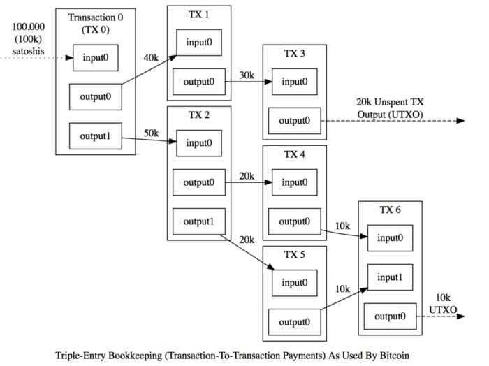

# 📚 Blockchain Learning Journey — Stage 3: UTXO System (Python)

## 📖 What I Learned

In this journey, I implemented a **UTXO (Unspent Transaction Output)** system to manage transactions in a Bitcoin-style blockchain.

---

### Key Concepts

#### 1️⃣ What is a UTXO?

* **UTXO** (Unspent Transaction Output) represents coins that can be spent in the future.
* Instead of tracking a single balance per account, the blockchain keeps track of individual spendable outputs.
* Each UTXO is unique and referenced by `tx_id` (transaction ID) + `out_index` (position in transaction outputs).

#### 2️⃣ How Transactions Work with UTXOs

A transaction consumes one or more UTXOs as **inputs** and creates one or more new UTXOs as **outputs**.

Each output has:
* `address`: the recipient’s address.
* `amount`: the number of coins.

An address can have multiple UTXOs, representing “fragments” of coins from different transactions.

**Example:**
Alice has 2 UTXOs: `30` coins and `20` coins. She wants to send `40` coins to Bob.
* **Input:** `30` + `20` (total `50`)
* **Output:** `40` to Bob, `10` back to Alice (change)

Old UTXOs are deleted, and new UTXOs are created.



#### 3️⃣ UTXO Lifecycle

* **Creation**: UTXOs are created when a transaction is mined (or via genesis/coinbase for new coins).
* **Spending**: When included in a transaction input, a UTXO is consumed and removed from the UTXO set.
* **Change**: Any leftover amount goes back to the sender as a new UTXO.
* **Validation**: Transactions are valid only if:
    * Inputs exist in the UTXO set.
    * Inputs belong to the sender.
    * Total outputs ≤ total inputs.
    * Signature matches sender’s public key.

#### 4️⃣ Benefits of UTXO

* Prevents double-spending.
* Allows parallel processing of transactions.
* Makes blockchain stateless: nodes can verify transactions by checking the UTXO set only.

---

### 🧩 What Changed in the Code

#### 1️⃣ `Account.py`

* Generates a private/public key pair with **ECDSA**.
* Computes address as `RIPEMD160(SHA256(pubkey))`.
* `sign(message)` to sign transactions.

#### 2️⃣ `Transaction.py`

* New fields: `inputs`, `outputs`, `sender_public_key`, `signature`.
* Methods:
    * `_serialize_core()` and `calculate_tx_id()`: generate a unique transaction ID.
    * `sign_with()`: signs a transaction with the sender’s private key.
    * `verify_signature()`: checks ownership of inputs.
    * `total_output()`: sums of all outputs.
* Each transaction now consumes UTXOs from the sender and creates new outputs.

#### 3️⃣ `Blockchain.py`

* Added `self.utxos` dictionary to track unspent outputs.
* `create_genesis_utxo(address, amount)`: initializes an account with coins.
* `verify_transaction(tx)`:
    * Ensures inputs exist and belong to the sender.
    * Checks `total inputs ≥ total outputs`.
    * Verifies the signature.
* `index_block_utxos(block)`:
    * Removes spent UTXOs.
    * Adds outputs of newly mined transactions.
* `add_block(block)`: updates the UTXO set automatically after mining.
* `add_transaction(tx)`: queues valid transactions and mines automatically when ≥5 pending.

#### 4️⃣ `main.py`

* Initializes Alice, Bob, and Daniel accounts.
* Alice receives initial coins via `create_genesis_utxo`.
* `build_payment_tx()`:
    * Selects enough UTXOs to cover payment.
    * Builds transaction inputs/outputs (including change).
    * Signs the transaction with Alice’s private key.
* Adds 5 transactions to demonstrate UTXO usage.
* Prints the updated UTXO set after mining.

---

### 🔗 Example: UTXO Flow

| Alice’s initial UTXOs | Send 40 to Bob | Resulting UTXOs                    |
| --------------------- | -------------- | ---------------------------------- |
| 50                    | 40             | 10 back to Alice (change), 40 to Bob |

**Explanation:**

* **Inputs:** Alice’s `50` coins UTXO.
* **Outputs:**
    * `40` coins → Bob
    * `10` coins → Alice (change)
* Old UTXO consumed → removed from UTXO set.
* Two new UTXOs created → added to UTXO set.

---

### 🚀 How to Run

#### 1️⃣ Prerequisites

* Python 3.x
* Install `ecdsa`:
    ```bash
    pip install ecdsa
    ```

#### 2️⃣ Run Demo

```bash
python main.py
Example Output:

Plaintext

Created genesis UTXO 1f2d3c4b...:0 -> 500 to alice_address
Adding transaction 1 sending 30 to recipient 1...
Adding transaction 2 sending 20 to recipient 2...
Adding transaction 3 sending 50 to recipient 3...
Adding transaction 4 sending 10 to recipient 4...
Adding transaction 5 sending 15 to recipient 5...
Mining block 1...
Block mined: 0000ab3e...
UTXOs after mining: {'txid1:0': {'address': 'alice', 'amount': 375}, 'txid1:1': {'address'
